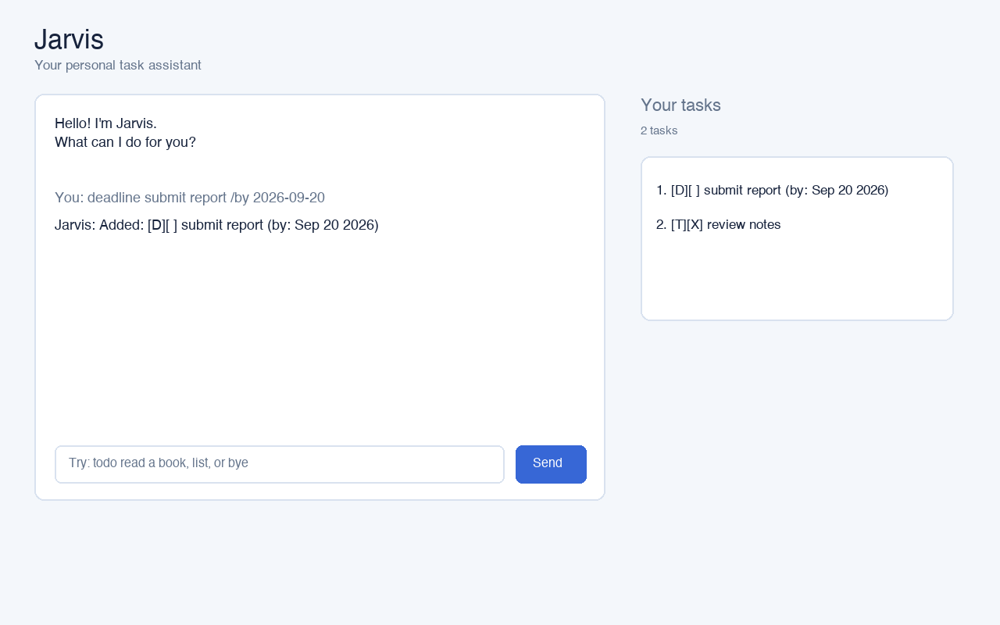

# Jarvis user guide

Jarvis is a friendly task-management chatbot with console and JavaFX
interfaces. It stores tasks in `data/jarvis.txt` and helps you capture,
organise, and complete everyday tasks.



## Commands

| Command | Example | Purpose |
| --- | --- | --- |
| `todo` | `todo read a book` | Adds a basic task. |
| `deadline` | `deadline submit report /by 2026-09-20` | Adds a task with a due date. |
| `event` | `event project meeting /from 2pm /to 3pm` | Adds a task with a time range. |
| `list` | `list` | Displays all tasks. |
| `find` | `find report` | Finds tasks containing a keyword. |
| `mark` | `mark 1` | Marks task 1 as done. |
| `unmark` | `unmark 1` | Marks task 1 as incomplete. |
| `delete` | `delete 1` | Deletes task 1. |
| `snooze` | `snooze 1 /by 2026-09-25` | Postpones a deadline. |
| `bye` | `bye` | Saves the task list and exits. |

Tasks can be created as a `todo`, `deadline`, or `event`. Deadlines use
`yyyy-mm-dd`; events use `/from ... /to ...`. Use `list` to see every task and
its number before using `mark`, `unmark`, `delete`, or `snooze`.

Task numbers are one-based and follow the order shown by `list`. Invalid
commands are reported without terminating the application.

## Running Jarvis

Use JDK 25. In IntelliJ, run `src/main/java/jarvis/Jarvis.java`. From the
project root, the graphical interface can be started with:

```sh
./gradlew runGui
```

For the console interface, run the `Jarvis.main()` method in IntelliJ or use
the Gradle/Java setup configured by the project. The graphical interface
provides the same core task operations through a resizable window; enter a
command in the field at the bottom and press Enter or click **Send**.

## Typical workflow

```text
todo revise lecture notes
deadline submit report /by 2026-09-20
event project meeting /from 2pm /to 3pm
list
mark 1
bye
```

Jarvis reports invalid commands and task numbers without closing the
application. Changes are saved automatically by the graphical interface and
when `bye` is used in the console interface.

## Keeping documentation and tests current

When a command or its visible output changes, update
[`test/ui-test-plan.md`](../test/ui-test-plan.md) with the inputs and exact
expected transcript. Follow the [Java coding standards](coding-standards.md)
and [Git conventions](git-conventions.md) for all accompanying changes.
